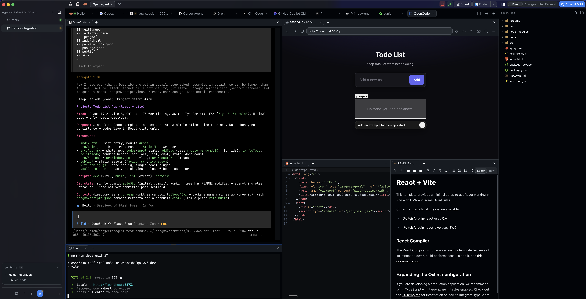

<div align="center">

<h1>Pragma</h1>

<h3>Run teams of coding agents in parallel.</h3>

<p>Run Claude Code, Codex, OpenCode, Cursor and more each in their own worktree.<br />
Agents, terminals, diffs, and pull requests in one workspace.</p>



<p>
  <a href="https://pragma-app.sh">Website</a>
  &nbsp;·&nbsp;
  <a href="https://pragma-app.sh/docs">Documentation</a>
  &nbsp;·&nbsp;
  <a href="https://github.com/pragma-sh/pragma/releases/latest">Download</a>
  &nbsp;·&nbsp;
  <a href="https://pragma-app.sh/plugins">Plugins</a>
  &nbsp;·&nbsp;
  <a href="./CONTRIBUTING.md">Contributing</a>
</p>

<p>
  <a href="https://github.com/pragma-sh/pragma/actions/workflows/ci.yml"></a>
  <a href="./LICENSE"></a>
  
  <a href="https://v2.tauri.app"></a>
  <a href="https://bun.sh"></a>
</p>

</div>

---

## Table of Contents

- [Why Pragma?](#why-pragma)
- [Quick Start](#quick-start)
- [Features](#features)
- [Supported Agents](#supported-agents)
- [Download](#download)
- [Documentation](#documentation)
- [Build From Source](#build-from-source)
- [Repository Map](#repository-map)
- [Contributing](#contributing)
- [License](#license)

## Why Pragma?

You can start five agents in a normal terminal window but it becomes hard to see which agent is doing what. Worse if you are running multipile agents in the same project their changes may collide.

Pragma is an open-source agentic development environment for people running many agents in parallel. Projects, worktrees, terminals, files, diffs, pull requests, and agent status live in one workspace — while every coding agent keeps running through its own native TUI, exactly as its authors shipped it.

There are many tools like Pragma so here is a comparison:

| Capability                                                                                  | Pragma                                   | Emdash     | Orca                                | Superset                      |
| ------------------------------------------------------------------------------------------- | ---------------------------------------- | ---------- | ----------------------------------- | ----------------------------- |
| **Native shell**<br>Rust host + the OS webview, not a bundled browser                       | **Tauri + Rust**                         | Electron   | Electron                            | Electron                      |
| **Agents as plugins**<br>Each integration a versioned package with official branding        | **✅**                                   | 🟡         | 🟡                                  | 🟡                            |
| **Public plugin API**<br>Third-party sidebar tabs, cards, web views, and commands           | **✅**                                   | ❌         | ❌                                  | ❌                            |
| **Programmable automations**<br>Your TypeScript on host events, not just a schedule         | **✅**                                   | 🟡         | 🟡                                  | 🟡                            |
| **Interactive scratchpads**<br>Agents write MDX with live React you can edit and comment on | **✅**                                   | ❌         | ❌                                  | ❌                            |
| **Agent board**<br>Prompt to review to pull request as tracked cards                        | **✅**                                   | ❌         | ❌                                  | ✅                            |
| **Fanout + comparison view**<br>One prompt into N attempts, compared side by side           | **✅**                                   | ❌         | ✅                                  | 🟡                            |
| **Editing suite**<br>Code, markdown WYSIWYG, PDF, image, video, and audio                   | **✅**                                   | 🟡         | 🟡                                  | 🟡                            |
| **Built-in AI, your key**<br>Inline ⌘K edits, one-click PR drafting, ask from the palette   | **✅**                                   | ❌         | 🟡                                  | ❌                            |
| **Mobile and web client**<br>What ships, and how you reach it off your LAN                  | **iOS, Android, Web**<br>your own tunnel | ❌         | iOS, Android<br>needs Tailscale/VPS | iOS only, Pro<br>hosted relay |
| **Persistent host server**<br>Sessions, tunnels, headless launches survive quitting         | **✅**                                   | 🟡         | 🟡                                  | 🟡                            |
| **Remote projects**<br>SSH hosts as first-class remote projects                             | **SSH**                                  | SSH        | SSH + WSL                           | ❌                            |
| **User themes**<br>Editable colour tokens per project, not a fixed preset list              | **✅**                                   | 🟡         | 🟡                                  | 🟡                            |
| **License**<br>What you may do with the source                                              | **AGPL-3.0**                             | Apache-2.0 | MIT                                 | Elastic 2.0                   |

✅ yes  ·  🟡 partial  ·  ❌ no

Checked against the `generalaction/emdash`, `stablyai/orca`, and `superset-sh/superset` repositories as of 2026-08-29. These projects ship fast — if something here is out of date, open an issue and we will correct it. On the mobile row: Pragma's tunnel is a command you supply and control (ngrok, cloudflared, a Tailscale funnel — whatever you already run), not a vendor relay you depend on. Orca has no tunnel of its own; remote access means installing Tailscale yourself or running Orca's full server on a VPS. Superset's reaches your machine through Superset's own hosted relay, and the iOS app is Pro-plan only.

## Quick Start

Download the signed build for macOS, Linux, or Windows from [GitHub Releases](https://github.com/pragma-sh/pragma/releases) — see [Download](#download).

## Features

### 🌿 Parallel by default

Launch Claude Code, Codex, OpenCode, Cursor, and friends in separate branches and worktrees. No collisions, no stashing, no "wait, which agent touched this file?"

### 🔀 Fanout — one prompt, many attempts

Send a single prompt to several isolated attempts, compare their terminals, diffs, and scratchpads side by side, then keep the strongest result and throw the rest away.

### 🔌 Persistent sessions

Terminals and scrollback live on the host, not in the window. Close the app, drop the network, move to another machine — the agent keeps working and the scrollback is still there.

### 🔍 One review surface

Inspect diffs, stage files, commit, push branches, and manage GitHub pull requests beside the agent that wrote the code.

### 🛰️ Local-first, and anywhere

Run on your machine, over SSH, or inside WSL. Desktop app on macOS, Linux, and Windows, with companion access from iOS, Android, and the browser.

### 🧩 Extensible

Plugins add UI, commands, agents, and themes. Automations run scheduled and event-driven host tasks. The CLI and the typed `@pragma/sdk` drive all of it from scripts.

[**▶ Watch the feature tour →**](https://pragma-app.sh)

## Supported Agents

Every agent runs through its own native CLI. Pragma adds a plugin so it reports status and shows up in the launcher.

Missing yours? Agent plugins are ordinary TypeScript packages — see the [plugin guide](https://pragma-app.sh/docs/plugins).

## Download

Pragma is in active development. Signed desktop installers are published through [**GitHub Releases**](https://github.com/pragma-sh/pragma/releases). Until the first release lands, use [Build From Source](#build-from-source).

| Platform | Packages                   |
| -------- | -------------------------- |
| macOS    | Application bundle and DMG |
| Linux    | DEB, RPM, and AppImage     |
| Windows  | MSI and NSIS installers    |

The newest build lives at the [latest release link](https://github.com/pragma-sh/pragma/releases/latest); release notes and older builds are on the [releases page](https://github.com/pragma-sh/pragma/releases).

## Documentation

| Resource                                                    | What it covers                                         |
| ----------------------------------------------------------- | ------------------------------------------------------ |
| [Website](https://pragma-app.sh)                            | Product overview and feature tour                      |
| [Documentation](https://pragma-app.sh/docs)                 | Main documentation hub                                 |
| [User guide](https://pragma-app.sh/docs/user-guide)         | Projects, worktrees, agents, review, and settings      |
| [CLI reference](https://pragma-app.sh/docs/cli)             | Control Pragma and report agent status from a terminal |
| [TypeScript SDK](https://pragma-app.sh/docs/sdk)            | Build typed integrations with `@pragma/sdk`            |
| [Plugin development](https://pragma-app.sh/docs/plugins)    | Add UI, commands, agents, themes, and integrations     |
| [Plugin gallery](https://pragma-app.sh/plugins)             | Browse available Pragma plugins                        |
| [Automations](https://pragma-app.sh/docs/automations)       | Run scheduled and event-driven host tasks              |
| [Architecture wiki](https://pragma-app.sh/docs/wiki)        | Desktop, server, gateway, and protocol layers          |
| [Issue tracker](https://github.com/pragma-sh/pragma/issues) | Report bugs and request features                       |

## Build From Source

Prerequisites:

- [Bun](https://bun.sh/) 1.3.14 or newer
- Stable [Rust toolchain](https://www.rust-lang.org/tools/install) with clippy and rustfmt
- [Tauri system prerequisites](https://v2.tauri.app/start/prerequisites/) for your platform

```bash
git clone https://github.com/pragma-sh/pragma.git
cd pragma
bun install
bun run dev
```

See [CONTRIBUTING.md](./CONTRIBUTING.md) for mobile, web, and docs dev workflows.

## Contributing

Read **[CONTRIBUTING.md](./CONTRIBUTING.md)** first — it covers the contribution policy, prerequisites, running the desktop app and Pragma Go, the project tour, style guidelines, commit style, and how to open a pull request.

**Policy in short: we only accept small features.** Bug fixes and other small, focused changes are the most likely to be merged; large features and sweeping refactors will almost certainly be declined. Open an issue before building anything non-trivial.

Before opening a pull request:

```bash
bun run check
bun run test
bun run rust:test
```

Use [Conventional Commits](https://www.conventionalcommits.org/) and include focused tests with behavior changes. `AGENTS.md` (and the per-package `AGENTS.md` files) hold the deeper architecture and platform rules for human and AI contributors alike. Bugs and ideas start in the [issue tracker](https://github.com/pragma-sh/pragma/issues).

## License

[GNU Affero General Public License v3.0](./LICENSE).

**If Pragma saves you a tab, [give it a star](https://github.com/pragma-sh/pragma/stargazers). ⭐**

Built with Tauri, Rust, React, and Bun.
